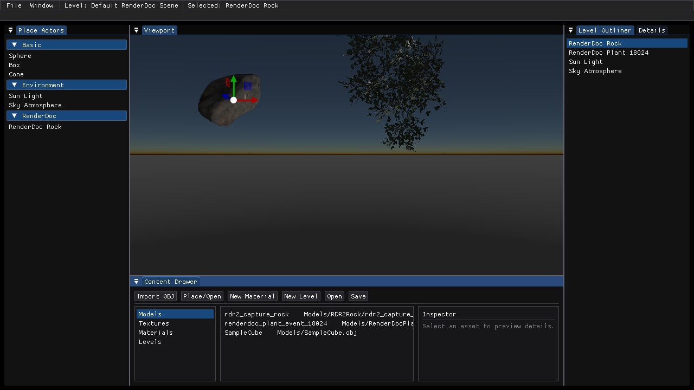

# AgX / ACES Tonemapping 原理、代码位置与打开方式

本分支新增了 AgX Tonemapping。它不是把画面简单套一个 LUT，而是在 HDR 后处理阶段把场景线性颜色映射到更适合显示器的 SDR 输出空间：先进入更宽的 Rec.2020 工作色域，再进入 AgX 的 inset 工作域，用 `log2` 曝光区间压缩高动态范围，经过一条默认对比度多项式曲线后再通过 outset 矩阵回到显示域。相比原来的 Reinhard `x / (x + 1)`，AgX 更关注高光肩部、饱和颜色和 PBR 材质颜色的稳定性，避免亮部快速发白或高饱和颜色塌陷。

参考资料：

- 视频目标：https://www.youtube.com/watch?v=-ozCZf6R2r0
- Blender 4.0 Color Management：AgX 被加入并替代 Filmic 作为新文件默认 view transform
  https://developer.blender.org/docs/release_notes/4.0/color_management/
- Blender Manual：AgX 面向 PBR color accuracy，并改善 Filmic 对饱和颜色的处理
  https://docs.blender.org/manual/en/dev/render/color_management/displays_views.html
- three.js AgX shader 参考实现：包含 Rec.2020、AgX inset/outset、EV 范围和 contrast approximation 常量
  https://github.com/mrdoob/three.js/blob/dev/src/renderers/shaders/ShaderChunk/tonemapping_pars_fragment.glsl.js
- ACES 官方 Output Transforms 文档：ACES 1 使用 RRT + ODT 组合输出变换
  https://docs.acescentral.com/system-components/output-transforms/
- ACES 1.0.3 官方 CTL 参考实现：`RRT.ctl` 与 `ODT.Academy.Rec709_100nits_dim.ctl`
  https://github.com/aces-aswf/aces-core/tree/v1.0.3/transforms/ctl

## 三种 Tonemapping 公式

下面的 `C` 表示曝光后的 HDR scene-linear RGB。除矩阵乘法和特别说明外，`+ / - / * / / / pow / log` 都按 RGB 分量逐分量执行。

### Reinhard

Reinhard 是当前工程里的最基础对照组。它只做一个逐通道压缩：

```text
C_hdr = max(C, 0)
C_ldr = C_hdr / (C_hdr + 1)
C_out = pow(C_ldr, 1 / gamma)
```

其中当前 `gamma = 2.2`。这个曲线简单稳定，但没有电影色彩管理里的色域、白点、观看环境和显示设备建模。

### AgX

AgX 路径对应 `shaders/tonemap.hlsl` 里的 `AgXTonemap`。当前实现先把 linear sRGB 转到 Rec.2020，再进入 AgX inset 工作域，压到 log2 EV 区间，经过默认对比度多项式，然后做 outset、AgX 的 `2.2` power shaping，最后回到 linear sRGB。

```text
C_2020 = M_srgb_to_rec2020 * C
C_in   = M_agx_inset * C_2020

E = saturate((log2(max(C_in, 1e-10)) - minEv) / (maxEv - minEv))
minEv = -12.47393
maxEv =  4.026069

P(E) = 15.5 E^6
     - 40.14 E^5
     + 31.96 E^4
     - 6.868 E^3
     + 0.4298 E^2
     + 0.1191 E
     - 0.00232

C_outset = M_agx_outset * P(E)
C_agx    = M_rec2020_to_srgb * pow(max(C_outset, 0), 2.2)
C_out    = pow(saturate(C_agx), 1 / gamma)
```

当前使用的矩阵：

```text
M_srgb_to_rec2020 =
[ 0.6274  0.3293  0.0433
  0.0691  0.9195  0.0113
  0.0164  0.0880  0.8956 ]

M_rec2020_to_srgb =
[  1.6605 -0.5876 -0.0728
  -0.1246  1.1329 -0.0083
  -0.0182 -0.1006  1.1187 ]

M_agx_inset =
[ 0.8566271533  0.0951212405  0.0482516061
  0.1373189729  0.7612419906  0.1014390365
  0.1118982130  0.0767994186  0.8113023684 ]

M_agx_outset =
[  1.1271005818 -0.1106066431 -0.0164939387
  -0.1413297635  1.1578237022 -0.0164939387
  -0.1413297635 -0.1106066431  1.2519364066 ]
```

### ACES 1.0 RRT + Rec.709 100nits dim ODT

ACES 路径对应 `ACESOfficialTonemap`。它不是一个单独曲线，而是把输入转换到 ACES AP0，然后执行 ACES 1.0 的 RRT，再执行 Rec.709 100nits dim ODT。当前实现为了在交换链里直接输出，ACES 分支内部已经做了 BT.1886 `2.4` 显示编码，因此不会再走公共 `gamma=2.2` 步骤。

总体组合：

```text
A     = M_srgbD65_to_acesAP0D60 * max(C, 0)
OCES  = RRT(A)
C_out = ODT_Rec709_100nits_dim(OCES)
```

RRT 的主要公式：

```text
sat0 = saturation(A) = (max(A) - max(min(A), tiny)) / max(max(A), 1e-2)

YC(A) = (R + G + B + 1.75 * sqrt(B*(B-G) + G*(G-R) + R*(R-B))) / 3

sigmoid(x) = (1 + sign(x) * (1 - max(1 - abs(x / 2), 0)^2)) / 2

glow_gain = 0.05 * sigmoid((saturation(A) - 0.4) / 0.2)
glow_mid  = 0.08

glow(YC) =
  glow_gain,                         YC <= 2/3 * glow_mid
  0,                                 YC >= 2   * glow_mid
  glow_gain * (glow_mid / YC - 1/2), otherwise

A_glow = A * (1 + glow(YC(A)))
```

RRT red modifier：

```text
hue = degrees(atan2(sqrt(3) * (G - B), 2R - G - B))
centered_hue = center_hue(hue, 0 degrees)
hue_weight = cubic_basis_shaper(centered_hue, 135 degrees)

A_red.r = A_glow.r + hue_weight * sat0 * (0.03 - A_glow.r) * (1 - 0.82)
A_red.g = A_glow.g
A_red.b = A_glow.b
```

RRT 渲染空间与 tone scale：

```text
R_ap1 = M_ap0_to_ap1 * max(A_red, 0)
R_sat = M_rrt_sat * max(R_ap1, 0)

R_toned.r = segmented_spline_c5(R_sat.r)
R_toned.g = segmented_spline_c5(R_sat.g)
R_toned.b = segmented_spline_c5(R_sat.b)

OCES = M_ap1_to_ap0 * R_toned
```

ODT 的主要公式：

```text
P_ap1 = M_ap0_to_ap1 * OCES

P_toned.r = segmented_spline_c9(P_ap1.r)
P_toned.g = segmented_spline_c9(P_ap1.g)
P_toned.b = segmented_spline_c9(P_ap1.b)

linearCV = (P_toned - 0.02) / (48.0 - 0.02)
linearCV = dark_to_dim_surround(linearCV)
linearCV = M_odt_sat * linearCV

XYZ_D60 = M_ap1_to_xyz * linearCV
XYZ_D65 = M_d60_to_d65 * XYZ_D60
Rec709_linear = saturate(M_xyz_to_rec709 * XYZ_D65)

C_out = pow(Rec709_linear, 1 / 2.4)
```

`segmented_spline_c5` 和 `segmented_spline_c9` 都使用同一个二次 B-spline 形式。给定某段的三个系数 `c0, c1, c2` 和局部坐标 `t`：

```text
B(c0, c1, c2, t) =
  (0.5*c0 - c1 + 0.5*c2) * t^2
  + (-c0 + c1) * t
  + 0.5 * (c0 + c1)

segmented_spline(x):
  logx = log10(max(x, epsilon))
  选择 low 或 high 区间，计算 knotCoord、j、t
  logy = B(coefs[j], coefs[j+1], coefs[j+2], t)
  y = 10^logy
```

RRT `segmented_spline_c5` 当前系数：

```text
coefsLow  = [-4.0000000000, -4.0000000000, -3.1573765773,
             -0.4852499958,  1.8477324706,  1.8477324706]
coefsHigh = [-0.7185482425,  2.0810307172,  3.6681241237,
              4.0000000000,  4.0000000000,  4.0000000000]
minPoint = (0.18 * 2^-15, 0.0001)
midPoint = (0.18,         4.8)
maxPoint = (0.18 * 2^18,  10000.0)
```

ODT `segmented_spline_c9` 当前系数：

```text
coefsLow  = [-1.6989700043, -1.6989700043, -1.4779000000,
             -1.2291000000, -0.8648000000, -0.4480000000,
              0.0051800000,  0.4511080334,  0.9113744414,
              0.9113744414]
coefsHigh = [ 0.5154386965,  0.8470437783,  1.1358000000,
              1.3802000000,  1.5197000000,  1.5985000000,
              1.6467000000,  1.6746091357,  1.6878733390,
              1.6878733390]
minPoint = (0.0028798932,    0.02)
midPoint = (4.8,             4.8)
maxPoint = (1005.7193595080, 48.0)
slopeHigh = 0.04
```

核心流程：

```text
HDR Scene Color
  -> Exposure
  -> Linear sRGB to Linear Rec.2020
  -> AgX inset matrix
  -> log2 EV normalize, min=-12.47393, max=4.026069
  -> AgX default contrast polynomial
  -> AgX outset matrix
  -> display power approximation
  -> Linear Rec.2020 to Linear sRGB
  -> Gamma correction
  -> BackBuffer
```

ACES 对比路径：

```text
HDR Scene Color (linear sRGB / Rec.709)
  -> D65 to D60 adapted ACES AP0
  -> ACES 1.0 RRT glow / red modifier / AP1 render space
  -> RRT segmented_spline_c5 tonescale
  -> ODT Rec.709 100nits dim segmented_spline_c9
  -> dark-to-dim surround compensation
  -> D60 to D65 adapted Rec.709
  -> BT.1886 2.4 display encoding
  -> BackBuffer
```

对应代码：

- `shaders/tonemap.hlsl`
  - `AgXTonemap`：AgX 主流程
  - `AgXDefaultContrastApprox`：默认对比度多项式
  - `LinearSRGBToLinearRec2020` / `LinearRec2020ToLinearSRGB`：sRGB 与 Rec.2020 工作色域转换
  - `AgXInsetTransform` / `AgXOutsetTransform`：AgX 工作域矩阵
  - `ACESOfficialTonemap`：ACES 1.0 RRT + Rec.709 100nits dim ODT 对比路径
  - `ACESSegmentedSplineC5` / `ACESSegmentedSplineC9`：来自官方 CTL 的 RRT/ODT tone scale
- `src/Renderer/TonemapTypes.h`
  - `ETonemapOperator::None / Reinhard / AgX / ACES`
- `src/Renderer/Passes/TonemapPass.cpp`
  - `UpdateTonemapCB` 把当前 Tonemap operator 写入后处理常量缓冲
- `src/Renderer/SceneRenderer.cpp` 与 `src/Renderer/SimpleSceneRenderer.cpp`
  - 把编辑器选择的 Tonemap operator 传入渲染帧
- `src/Engine/Engine.cpp`
  - `Render Settings` 中的 `Tonemap Operator` 下拉框，支持 `Reinhard`、`AgX` 与 `ACES 1.0 RRT+ODT`
- `Docs/AgXTonemapping.md`
  - 更短的实现说明和对比说明

打开方式：

```powershell
git fetch origin AgX_Tonemapping
git switch --track origin/AgX_Tonemapping

& 'C:\Program Files\Microsoft Visual Studio\18\Community\MSBuild\Current\Bin\MSBuild.exe' build_vs\DX12HelloTriangle.sln /p:Configuration=Release /p:Platform=x64 /m
.\build_vs\Release\dx12_hello.exe
```

进入编辑器后，打开顶部 `Settings` / `Render Settings`，确认：

```text
Tonemap = On
Tonemap Operator = AgX
```

如果需要和旧效果对比，把 `Tonemap Operator` 切回 `Reinhard`；如果需要和官方 ACES 1.0 SDR 输出变换对比，切到 `ACES 1.0 RRT+ODT`。

# FrameRenderer

FrameRenderer 是一个基于 DirectX 12 的编辑器和渲染器，目标是把 RenderDoc 截帧里的真实资源还原成可运行、可编辑、可保存的渲染场景。

这个项目不是把截帧截图贴到窗口里，而是把截帧证据转成项目资源：模型、纹理、材质、shader 语义、关卡和验证截图。导入后的对象应该能像普通场景物体一样被选中、移动、指定材质、保存到 Level，并由渲染器重新渲染出来。

## 当前界面



## 当前分支内容

当前分支是 RenderDoc 截帧还原的最小基础工程：

- 默认启动关卡：`Content/Levels/default_renderdoc_scene.level.json`
- 默认场景：一个 RenderDoc 岩石、一个 RenderDoc 植被、`Sun Light`、`Sky Atmosphere`
- 岩石材质模式：`Rdr2Rock`
- 植被材质模式：`Rdr2Foliage`
- 材质系统：v2 `.material.json`，包含 `shadingMode`、`params`、`textures`
- 编辑器 UI：基于 ImGui 的 Place Actors、Level Outliner、Details、Content Drawer、Material Editor、Render Settings
- 仓库内 AI Skill：`skills/renderdoc-frame-reconstruction/SKILL.md`

## RenderDoc 截帧还原 Skill

这个分支内置了一个给后续 AI 使用的 Codex skill：

```text
skills/renderdoc-frame-reconstruction/
  SKILL.md
  agents/openai.yaml
```

当任务是把 RenderDoc `.rdc`、RenderDoc 导出的 manifest、或者已导出的截帧资源还原到 FrameRenderer 时，应该先阅读并使用这个 skill。

skill 覆盖的流程包括：

- 选择并记录目标 draw / event
- 提取 geometry、texture binding、shader、uniform、render state
- 创建 `Content/Models`、`Content/Textures`、`Content/Materials`、`Content/Levels` 资源
- 复用或新增 `PbrLit`、`Unlit`、`Rdr2Rock`、`Rdr2Foliage` 等材质模式
- 用真实运行截图验证结果，而不是依赖截图代理

## 已导入的截帧资产

### RenderDoc Rock

- 模型：`Content/Models/RDR2Rock/rdr2_capture_rock.obj`
- 专用 renderer manifest：`Content/Models/RDR2Rock/CaptureRockManifest.json`
- 专用 renderer mesh buffers：`Content/Models/RDR2Rock/meshes/*.bin`
- 材质：`Content/Materials/RDR2Rock/rdr2_capture_rock.material.json`
- 纹理：`Content/Textures/RDR2Rock/*.dds`
- 材质模式：`Rdr2Rock`

### RenderDoc Plant

- 模型：`Content/Models/RenderDocPlant/renderdoc_plant_event_18024.obj`
- 材质：`Content/Materials/RenderDocPlant/renderdoc_plant_event_18024.material.json`
- 纹理：
  - `Content/Textures/RenderDocPlant/102006_basecolor_alpha.dds`
  - `Content/Textures/RenderDocPlant/102008_mask.dds`
  - `Content/Textures/RenderDocPlant/102010_normal.dds`
- 材质模式：`Rdr2Foliage`
- 截帧事件：`event_id=18024`，draw `1384`

## 编译

推荐 Release 编译命令：

```powershell
& 'C:\Program Files\Microsoft Visual Studio\18\Community\MSBuild\Current\Bin\MSBuild.exe' build_vs\DX12HelloTriangle.sln /p:Configuration=Release /p:Platform=x64 /m
```

也可以重新生成 CMake 工程：

```powershell
cmake -S . -B build_vs -G "Visual Studio 17 2022" -A x64
cmake --build build_vs --config Release
```

可执行文件路径：

```text
build_vs/Release/dx12_hello.exe
```

## 运行

运行默认 RenderDoc 场景：

```powershell
.\build_vs\Release\dx12_hello.exe
```

指定启动某个 Level：

```powershell
$env:SHELLENGINE_START_LEVEL = 'Content/Levels/renderdoc_plant_event_18024.level.json'
.\build_vs\Release\dx12_hello.exe
```

运行并截取验证图：

```powershell
$env:SHELLENGINE_START_LEVEL = 'Content/Levels/default_renderdoc_scene.level.json'
$env:SHELLENGINE_CAPTURE_FRAME_PATH = "$env:TEMP\fr_default_renderdoc_scene.png"
$env:SHELLENGINE_CAPTURE_FRAME_INDEX = '5'
.\build_vs\Release\dx12_hello.exe
```

## 编辑器操作

- 鼠标右键拖动：旋转 / 飞行相机
- `WASDQE`：飞行模式下移动相机
- `Shift`：加快相机移动
- 飞行时滚轮：调整相机速度
- 鼠标左键：选择物体或 gizmo 轴
- `W`：平移 gizmo
- `R`：缩放 gizmo
- `Delete`：删除选中物体
- Place Actors：添加基础模型、环境对象和 RenderDoc 对象
- Level Outliner：查看并选择关卡中的对象
- Details：编辑 Transform，并为可渲染对象指定具体材质
- Content Drawer：浏览模型、纹理、材质和关卡
- Material Editor：编辑材质的 `shadingMode`、参数和纹理插槽
- Render Settings：切换渲染路径和全局渲染开关

## 目录结构

```text
Content/
  Levels/
  Materials/
    Default/
    RDR2Rock/
    RenderDocPlant/
  Models/
    RDR2Rock/
      meshes/
    RenderDocPlant/
  Textures/
    RDR2Rock/
    RenderDocPlant/
skills/
  renderdoc-frame-reconstruction/
src/
shaders/
tools/
```

## 材质模式

- `PbrLit`：标准光照 PBR 材质
- `Unlit`：不参与光照的颜色 / 强度材质
- `Rdr2Rock`：从 RenderDoc 截帧还原的岩石材质模式
- `Rdr2Foliage`：从 RenderDoc 截帧还原的植被材质模式，支持双面渲染、alpha cutout、顶点色 tint、法线输入和 mask 推导粗糙度

所有可渲染场景对象都应该引用一个真实的 `.material.json`。默认兜底材质是 `Content/Materials/Default/default_pbr.material.json`。

运行时真正加载的模型、纹理、材质、关卡和专用 renderer manifest 都应该放在 `Content` 下。RenderDoc 原始 shader bytecode、分析 README、本地截帧路径等证据类文件默认只保留本地，不提交到 Git。

## 验证清单

一个 RenderDoc 资源导入完成前，至少需要确认：

- Release 编译通过
- 对象以真实 mesh 数据导入，而不是截图代理
- 必要纹理已经复制到 `Content/Textures`
- 已创建并绑定 v2 材质
- 已在 `Content/Levels` 下创建可运行 Level
- 纯分析证据只保留本地，不提交到 Git
- 已从运行中的渲染器截取验证图
- 编辑器可以选择、移动、查看、保存导入对象

## 项目边界

FrameRenderer 仍然是一个紧凑的截帧还原渲染器，不是完整 UE5 替代品。项目优先保证系统清晰、资源路径可追踪、材质和 shader 语义可验证，让 RenderDoc 截帧数据能够被持续导入、迭代和还原。
